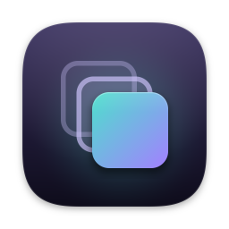
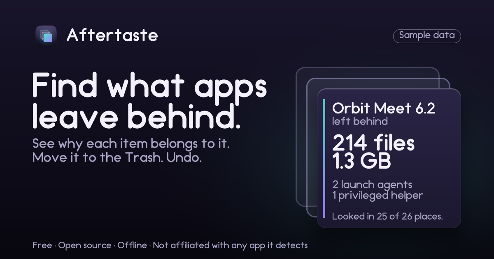

<p align="center"></p>

<h1 align="center">Aftertaste</h1>

<p align="center"><b>Find what apps leave behind. See why. Move it to the Trash. Undo.</b><br>
Free, open source, offline. Needs no permissions.</p>

Dragging an app to the Trash leaves its caches, preferences, saved state, containers and launch items behind. Aftertaste finds
them, shows **why** each one belongs to that app, moves the ones you choose to the Trash so you can **undo**, and gives you a
**Trace Report**: a card of measured numbers you can save or share. It is also plain about what no app can erase.

<p align="center"></p>

> The card above is **sample data** from demo mode, for a made-up app. Real numbers will replace it once testers have run it.

**Status: in development.** Nothing here has run on a real Mac yet; the first tester beta comes after CI is green on a macOS
runner and a few real Macs have tried it. What macOS lets an ordinary app read (above all inside `Containers` and
`Group Containers`) differs between versions and is not yet verified, so Aftertaste names the folders it could not read instead
of guessing. See [CHANGELOG.md](CHANGELOG.md).

## Trust box

- **No permissions required.** It never requires Full Disk Access. When macOS blocks a folder it says so and offers an optional Settings shortcut; it works without it. No Accessibility, Automation or administrator password. It is not
  sandboxed (a sandboxed app cannot see other apps' leftovers) and needs no entitlement.
- **No network.** Not an update check, not telemetry, not an account. CI rejects the common network APIs.
- **Two verbs only: Move to Trash and Undo.** No permanent deletion, no overwriting, no helper, no root. `FileManager.trashItem`
  is called from one file ([`Sources/AftertasteMac/Trasher.swift`](Sources/AftertasteMac/Trasher.swift)) and CI fails if it appears
  anywhere else.
- **Precision over recall.** A wrong move is the one failure this product cannot afford, so it would rather miss a leftover than
  take something that is still in use. Only items that rebuild themselves or are only settings are ticked for you.

## How it works

1. **Choose an app**: drop an `.app` on the window, pick one from the list, or ask for "leftovers of apps that are gone".
2. **Read the preview.** Every item shows its `~` path, size, a tier word, and one sentence of why. Nothing has moved yet.
3. **Press "Move N items to Trash".** Aftertaste checks each item again right before it moves (same item as at the scan, owner
   not running, not a link that leads elsewhere, not locked) and writes a line to its activity log first. If it cannot write
   the log, nothing moves.
4. **Undo from History** until you empty the Trash. Undo puts an item back where it came from and never overwrites anything.

### Tiers

| Tier | Meaning | Ticked for you | Moves |
|---|---|---|---|
| High | The name is exactly the app's bundle ID and the item rebuilds itself or is only settings (caches, preferences, saved state, logs, cookies) | Yes | in bulk |
| Medium | Likely this app's, may hold your own data (Application Support, containers, scripts, synced preferences) | No | in bulk, after the per-app "Include my data" switch and a tick in the confirm sheet |
| Review | Shared or ambiguous (Group Containers, name-only matches, vendor folders, anything that "may be your only copy") | No | one item at a time, each with its own confirmation |
| Hands off | Found and explained, never touched (Apple's, iCloud, running apps, items macOS protects, launch agents in v1) | No box | never |
| Needs admin | In `/Library` or needs an administrator (launch daemons, privileged helpers, receipts) | No box | never; "Reveal in Finder" and "Copy path" |

When you remove an app that is still installed elsewhere (a second copy, a Beta or Nightly channel, another app from the same
developer that shares a folder), the shared items drop to Review or Hands off.

## What it checks

It lists each place once and compares **names** to the app's identity (bundle ID, Team ID, helper IDs). It never recurses looking
for matches, never matches on part of a name, and never reads file contents. The one exception is the small property-list files
that say who an app or launch item is. Sizes are measured with `lstat`.

| Where (under `~/Library`) | What lives there | Highest tier |
|---|---|---|
| `Preferences`, `Preferences/ByHost` | Settings files named after the app | High |
| `Caches` | Rebuilt automatically | High |
| `Saved Application State`, `HTTPStorages`, `WebKit`, `Cookies` | Window state, web storage, sign-in cookies | High |
| `Logs`, `Logs/DiagnosticReports`, `Application Support/CrashReporter` | Logs and crash reports (a second proof is needed when only the name matches) | High |
| `Application Support/com.apple.sharedfilelist/...` | The app's recent-documents list | High |
| `Application Scripts`, `SyncedPreferences` | Scripts you wrote; preferences that sync to other devices | Medium |
| `Application Support`, `Containers` | The app's documents and data | Medium (name-only matches: Review; unreadable: Hands off) |
| `Group Containers` | Shared with other apps by the same developer | Review |
| `LaunchAgents` | Items that start at login (listed, not removed in v1) | Hands off |
| `Autosave Information` | Unsaved documents | Hands off |
| `/Library/...` (Application Support, Caches, Preferences, LaunchAgents, LaunchDaemons, PrivilegedHelperTools, Logs), `/private/var/db/receipts` | Items for all users and installer receipts | Needs admin |

Vendor folders that every product from a developer shares (Adobe, Microsoft, Google, Mozilla, JetBrains and similar) are never
above Review and never ticked. In an orphan scan an item can be High only if it is a cache or log with an exact bundle-ID name,
no installed owner, and untouched for 30 days.

## What it cannot do

Moving a file to the Trash does not erase it. The data stays on the disk until the Trash is emptied and the space is reused, and
copies can exist where Aftertaste cannot look. It tells you so, in the app, in these words or close to them:

- It reads only what macOS lets an ordinary app read. When macOS protects a folder, Aftertaste says so by name and tells you how
  to look yourself. It says "Looked in 25 of 26 places", never "all clear" with partial coverage.
- **Not covered:** keychain items, login and background item records, Launch Services and Spotlight entries, iCloud data, other
  users, backups and local snapshots, `/private/var`, the unified log.
- **No overwrite of any kind.** There is no "overwrite deleted data" and no free-space fill: on a flash (SSD) Mac they cannot
  reach every copy, and they would support a claim this app cannot back. The **Erase readiness** panel instead reads, without
  changing anything, whether FileVault is on, what kind of storage this Mac has, and how many local snapshots exist, and points to
  Apple's Erase All Content and Settings for a real erase.
- **Launch agents, launch daemons and privileged helpers are listed, not removed** (removing the file does not stop a job that is
  already loaded; the system-wide ones need an administrator).
- It cannot tell you that an app's data is gone from your Mac. The Trace Report footer says what it is: "This is a list of what
  was found in the places listed above. It is not proof that anything was erased."

What the project will never claim is a CI check. `tools/banned_phrases.txt` lists the phrases, and `bash tools/safety_greps.sh` fails if one appears in `App/`, `Sources/`, `site/`, this README or the changelog without a marker that says why. <!-- no-claim-ok: describes the banned-phrase check -->

## The activity log

Each move is written to `~/Library/Application Support/Aftertaste/journal-YYYY-MM.jsonl` (readable only by you, one file per
month, append-only) **before** it happens, and its result after. It holds the item's path with `~` for your home folder, its
size, the tier and the reason, so that Undo can find it in the Trash. It never leaves your Mac, and nothing else in the app is
stored beyond a small inventory of installed apps in the same folder and your preferences.

## Privacy

Aftertaste is offline: no analytics, no accounts, no crash reporting. A list of installed apps is sensitive, so the Trace Report
can hide app names (App 1, App 2) and strips your home folder from every path. "Copy diagnostics" lists which folders macOS let
the app read and holds no file names. GitHub serves the website and the downloads and sees visitors' addresses.

## Install

Until a Developer ID exists, public builds are unsigned betas, and macOS blocks the first launch:

1. Download `Aftertaste-<version>.zip` from [Releases](https://github.com/EverydayOpen/aftertaste/releases) and check it against
   the `Aftertaste-<version>.zip.sha256` file attached to the same release
   (`shasum -a 256 -c Aftertaste-<version>.zip.sha256`, run next to the zip). Never paste a Terminal command to install it.
2. Move **Aftertaste** to Applications. Right-click it › **Open**, then **Open** again. On macOS 15 and later, open it once, then
   System Settings › Privacy & Security › **Open Anyway**.

Requires macOS 13 or later, Apple silicon or Intel. There is no auto-update: "Check for updates" opens the Releases page.

### Build from source

```sh
swift test                                  # Core, Mac and real-filesystem tests (macOS)
brew install xcodegen && xcodegen generate  # writes Aftertaste.xcodeproj (never committed)
xcodebuild -project Aftertaste.xcodeproj -scheme Aftertaste -configuration Release build
```

`AftertasteCore` (matching, tiers, planning, text, the demo) is Foundation-only and also builds and tests on Linux:
`bash tools/test_core_docker.sh`.

## Reporting a wrong match

Use **Help › Copy Diagnostics** and the [wrong-match form](https://github.com/EverydayOpen/aftertaste/issues/new?template=wrong-match.yml).
If Aftertaste moved something you did not tick, say so first: look in the Trash and use History › Undo, and treat it as a bug
that needs a fix before anyone else uses that build.

## Contributing

[AGENTS.md](AGENTS.md) has the rules and [docs/BUILD_PLAN.md](docs/BUILD_PLAN.md) the contract, in particular the safety rules:
this app moves other apps' files, so a bug can take the wrong thing. `bash tools/safety_greps.sh` and
`bash tools/repo_checks.sh` run the mechanical ones locally. Matching rules are plain data in
[`Sources/AftertasteCore/Rules`](Sources/AftertasteCore/Rules), one line per place, so adding a case is a small pull request with
a fixture.

## Not affiliated

Aftertaste is not affiliated with or endorsed by any app it detects. App names (for example Zoom, Slack, Adobe, Microsoft Office,
Firefox, JetBrains and Visual Studio Code) appear in the rules and tests only to say what Aftertaste looks for and protects;
no vendor logos are used. Apple, Mac and macOS are trademarks of Apple Inc.
